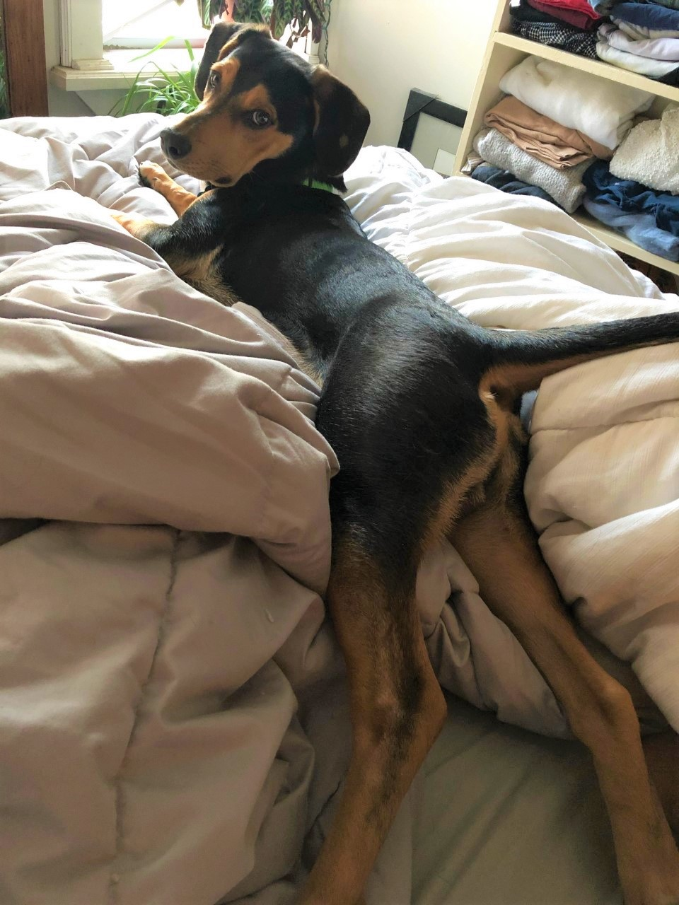
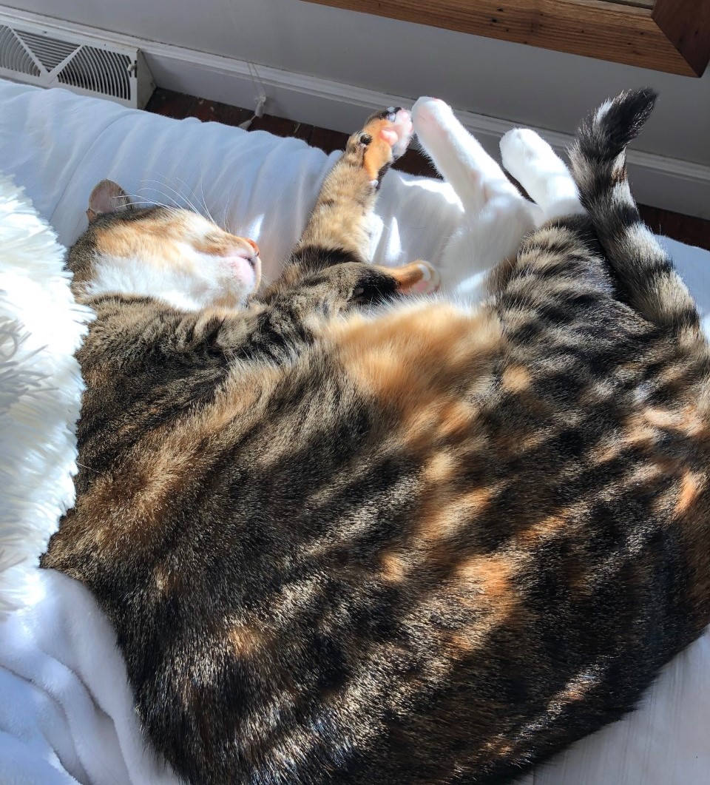
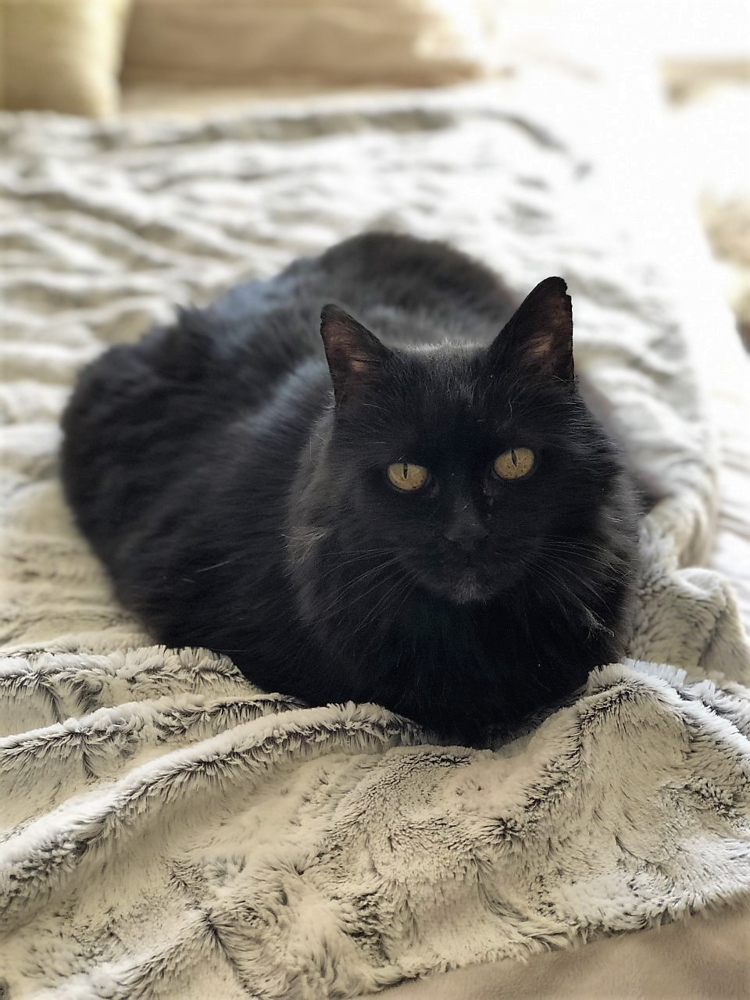

---
title: "biostat776-intro-Mary Grace-Bowring"
---
Last updated: `r format(Sys.time(), '%d %B, %Y')`

***

 

# About me
***

### Background
I am a non-traditional MD-PhD student starting a PhD in biomedical engineering this Fall. I graduated from college in 2012 having studied mathematics, education, and art. I completed an MPH in Epidemiology in DC in 2015 and worked as a research data analyst in Baltimore from 2015-2019 studying the epidemiology of solid organ transplantation. 

I am a married (wild I know) homeowner (even wilder), and we have one dog and two cats. Outside of medicine and research, I love to paint, try new recipes, be outdoors, and smother my pets with affection whether they want it or not. 

This is Neville. He is extremely dramatic.

This is Greta. She can't be bothered.

This is Stella. She has polydactyly and an unnecessary excess of toes.

 

### Training and experience

My MPH included coursework in epidemiology and biostatistics, with a few at the PhD level. While working as a research data analyst, I became proficient in Stata and co-taught the summer Stata programming course at JHSPH two years in a row. 

Last summer, I started learning R. This summer, I started learning Python.

I hope to learn best practices in reproducible data analysis with R and GitHub from this course. Open-source, reproducible, and accessible research is a key part of data harmonization and the work I hope to do for my PhD. 

### Research interests

* Data harmonization and common data models
* Machine learning and precision medicine (from algorithm to bedside)
* Health inequity in the context AI and algorithm biases
* Solid organ transplantation and immunodeficiency

  

# Five fun facts

***

* I am currently growing a human - it should come out in December!
* I once named a scientific paper after the DJ Snake song 'Turn Down for What.'
  + [Here it is.](https://onlinelibrary.wiley.com/doi/10.1111/ajt.14577)
* I went skydiving in Bel Air, MD, and I highly recommend it. 
* My latest painting is a 4'x5' depiction of the [chrysoara hysoscella jellyfish](https://www.istockphoto.com/photos/chrysaora-hysoscella)
* I grew up on a farm and used to teach horse-back riding. 

  

# Exciting website

***

I have recently joined the [OHDSI community](ohdsi.org), which stands for Observational Health Data Sciences and Informatics. It is an incredible global effort to demonstrate the value of robust large-scale observational research. Through this network, we can perform analyses across claims data and electronic health records in ways I never could have imagined. 

